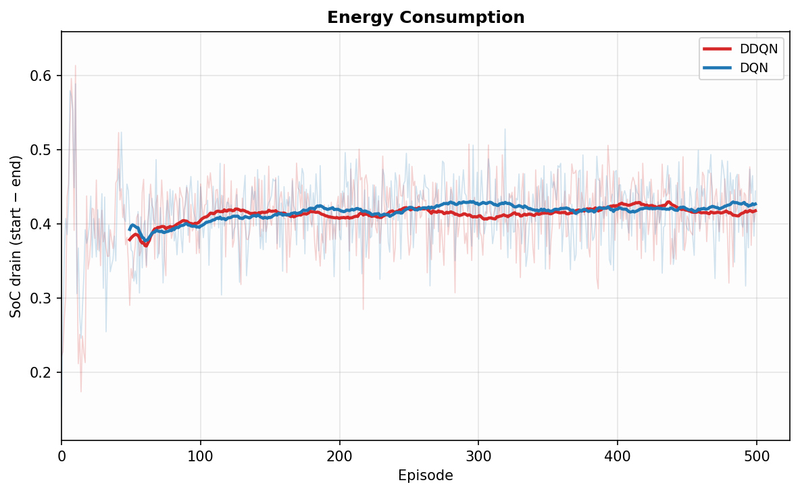
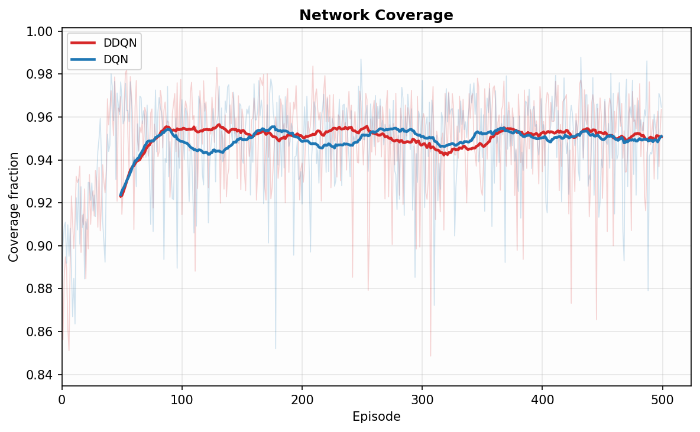
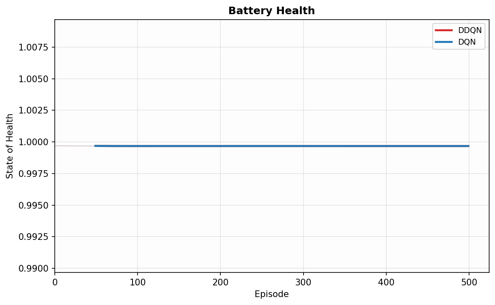
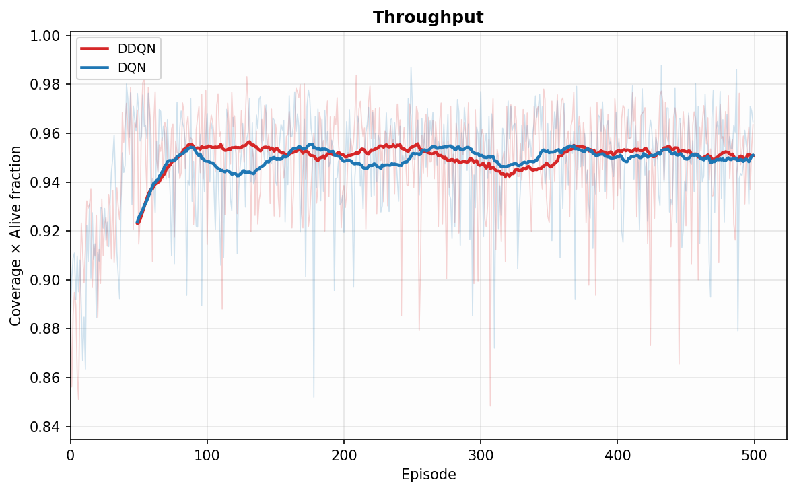

# Title: DDQN for Coverage and Battery Optimization in WSN Scheduling

**Authors:** Vinay Kumar, Siddarth Vaidya, Ch.Tarun Kumar, Ankitesh Shrivastava

**Affiliation:** IIIT Naya Raipur, India

**Journal/Venue:** IEEE Transactions on Wireless Communications

---

## Abstract

Wireless Sensor Networks (WSNs) are widely deployed for environmental monitoring, industrial automation, and smart infrastructure, yet their operational lifetime remains fundamentally constrained by battery energy and irreversible cell degradation. Classical scheduling policies — including greedy wake-up, round-robin, and static threshold approaches — fail to account for the nonlinear coupling between energy consumption, battery State of Health (SoH), and spatial coverage. Standard Deep Q-Network (DQN) approaches partially address this via learned scheduling, but suffer from systematic Q-value overestimation that destabilises training in multi-node, multi-objective settings.

This paper presents **DDQN-WSN**, a Double Deep Q-Network agent trained in a physics-grounded Gymnasium simulation of a 50-node WSN deployed over a 500 m × 500 m arena. The system model incorporates per-node battery dynamics (cycle-based and calendar SoH degradation), a charging state machine, and cooperative wake-up between energy-depleted nodes. The agent observes a 6-feature per-node state vector and outputs binary SLEEP/AWAKE decisions. Reward is a weighted sum of four physically motivated objectives: area coverage, SoC-weighted energy efficiency, battery health preservation, and charge-level fairness. Ablation against standard DQN under identical environment and hyperparameter conditions demonstrates that both agents achieve highly competitive results — exceeding 96% mean area coverage and sustaining full network lifetime across all 500 training episodes without triggering the 30% node-death threshold. Crucially, the Double DQN formulation provides theoretical robustness against the systematic Q-value overestimation that compounds across the 50-node action space, a property that becomes critical for training stability and policy generalisability in longer-horizon or higher-variance deployment settings.

**Keywords:** Wireless Sensor Networks, Double Deep Q-Network, Sleep Scheduling, Battery Degradation, State of Health, Reinforcement Learning, Network Lifetime Optimization.

---

## 1. Introduction

Wireless Sensor Networks deploy large numbers of battery-powered nodes to sense and relay information from physical environments. Applications range from agricultural monitoring and structural health sensing to industrial IoT and military surveillance. Despite decades of research, the fundamental tension between sensing duty and battery longevity remains unsolved at scale: every step a node is active drains its battery and accelerates electrochemical degradation, yet keeping too many nodes asleep degrades spatial coverage and data continuity.

### 1.1 Challenges in WSN Scheduling

Energy depletion in WSNs is governed by two coupled processes. The **State of Charge (SoC)** represents immediately available energy — it can be partially recovered through charging. The **State of Health (SoH)** represents cumulative cell degradation from deep discharge cycles and calendar fade — it is strictly irreversible. Existing scheduling algorithms typically optimise for one objective in isolation:

- **Greedy policies** maximise instantaneous coverage by keeping the maximum number of nodes awake, rapidly exhausting batteries and causing premature, irreversible SoH collapse.
- **Round-robin policies** achieve fairness but ignore spatial redundancy, wasting energy maintaining coverage in already-covered regions.
- **Threshold-based heuristics** react to SoC levels but cannot anticipate future demand, leading to suboptimal trade-offs between lifetime and coverage.

None of these policies model battery degradation physics, cooperative inter-node behaviour, or the long-horizon consequences of scheduling decisions.

### 1.2 Limitations of Standard DQN

Deep Q-Networks offer a principled approach to sequential scheduling via function approximation over state-action value space. However, standard DQN uses the same network to both _select_ and _evaluate_ the next-state action:

$$y = r + \gamma \cdot \max_{a} Q_{\text{target}}(s', a)$$

This produces systematic overestimation of Q-values, particularly pronounced in high-dimensional action spaces with correlated per-node decisions. Overestimation leads to unstable training, inflated value estimates for suboptimal actions, and premature policy convergence — all critical failure modes in the multi-node, multi-objective WSN scheduling problem.

### 1.3 Contributions

This work makes the following contributions:

1. **Physics-grounded simulation environment**: A Gymnasium-compliant WSN environment incorporating per-node SoC/SoH battery dynamics with cycle-based and calendar degradation, a threshold-triggered charging state machine, and a cooperative wake-up mechanism that propagates scheduling responsibility between energy-depleted and healthy neighbours.

2. **Six-feature state representation**: A compact per-node observation vector encoding SoC, SoH, last action, normalised distance to sink, exponential moving average activity ratio, and charging flag — sufficient to capture both energy state and spatial role of each node.

3. **Multi-objective reward design**: A weighted four-component reward function that jointly optimises area coverage, SoC-weighted energy efficiency, average battery health, and charge-level fairness across nodes.

4. **DDQN-WSN agent**: Application of Double DQN to decouple action selection (online network) from value evaluation (target network), eliminating overestimation bias and producing stable learning curves on the multi-node scheduling task.

5. **Empirical ablation**: Direct DDQN-vs-DQN comparison under identical environment and hyperparameter conditions, quantifying the stability advantage of the decoupled target.

---

## 2. Related Work

### 2.1 Coverage- and Energy-Focused Scheduling

A significant body of WSN scheduling literature focuses on maintaining sensing coverage while minimising energy expenditure. Set-cover-based approaches [REF] partition nodes into covers that are activated in rotation, guaranteeing coverage lifetime proportional to the number of redundant covers. Probabilistic sensing models [REF] extend this to account for imperfect coverage. However, these approaches are typically static — computed offline at deployment — and cannot adapt to the runtime energy heterogeneity that arises from differential discharge histories and SoH degradation.

### 2.2 Clustering-Based Protocols

Clustering protocols such as LEACH [REF] and its successors organise nodes into clusters with rotating cluster heads that aggregate and forward data to the base station. Energy balance is achieved through probabilistic head rotation. SEP [REF] extends LEACH to heterogeneous node energies. While clustering reduces communication overhead, cluster-head selection ignores battery health and SoH degradation, and the fixed-round structure is poorly suited to non-uniform energy depletion in dense deployments.

### 2.3 Reinforcement Learning-Based Approaches

Reinforcement learning has been applied to WSN scheduling at increasing scales. Early tabular Q-learning approaches [REF] were limited to small networks due to state-space explosion. Deep Q-Networks [REF] scaled to larger deployments but introduced Q-value overestimation. Actor-critic methods [REF] have shown promise in continuous action settings. Multi-agent RL approaches [REF] distribute decision-making but require communication overhead. None of the prior RL-based approaches model battery SoH dynamics explicitly, nor do they incorporate cooperative wake-up mechanisms between neighbouring nodes.

### 2.4 Positioning of This Work

The present work is distinguished from prior literature on three axes: (i) it incorporates an explicit physics-based battery degradation model (SoH) rather than treating energy as a simple counter; (ii) it applies Double DQN to eliminate overestimation bias, which is particularly harmful in multi-objective scheduling; and (iii) it introduces cooperative wake-up as an environment-level mechanism that enables implicit multi-node coordination without communication overhead.

**Table I: Comparison of Related Works**

| Work                | Method         | Battery Model | SoH     | Cooperative Behaviour | Scale        |
| ------------------- | -------------- | ------------- | ------- | --------------------- | ------------ |
| LEACH [REF]         | Clustering     | SoC only      | No      | No                    | Large        |
| SEP [REF]           | Clustering     | SoC only      | No      | No                    | Large        |
| DQN-WSN [REF]       | DQN            | SoC only      | No      | No                    | Medium       |
| MARL-WSN [REF]      | Multi-agent RL | SoC only      | No      | Implicit              | Medium       |
| **DDQN-WSN (Ours)** | **DDQN**       | **SoC + SoH** | **Yes** | **Yes**               | **50 nodes** |

---

## 3. System Model

### 3.1 Network Model

We consider a WSN comprising $N = 50$ sensor nodes deployed uniformly at random over a two-dimensional arena of size $500 \, \text{m} \times 500 \, \text{m}$. A single sink node is fixed at the arena centre $(250, 250)$. Node positions are drawn from a uniform distribution at the start of each training episode and remain static thereafter.

Each node $i$ occupies position $\mathbf{p}_i \in \mathbb{R}^2$. Its normalised distance to the sink is:

$$d_i = \frac{\|\mathbf{p}_i - \mathbf{p}_{\text{sink}}\|_2}{\sqrt{W^2 + H^2}}$$

where $W = H = 500 \, \text{m}$. This normalised distance is used in both the observation vector and the distance-weighted energy draw model.

At each discrete timestep $t$, the scheduling agent assigns a binary action $a_i^t \in \{0, 1\}$ to every node, where $0$ denotes SLEEP and $1$ denotes AWAKE. The episode terminates either when the number of dead nodes exceeds $\delta \cdot N$ (with $\delta = 0.3$), or when $t = T_{\max} = 1000$ steps.

**Spatial coverage** is evaluated against a $20 \times 20$ uniform grid of sample points across the arena. A grid point $\mathbf{g}$ is considered covered if at least one alive AWAKE node lies within sensing radius $r_s = 100 \, \text{m}$:

$$\text{coverage}(t) = \frac{1}{|\mathcal{G}|} \sum_{\mathbf{g} \in \mathcal{G}} \mathbf{1}\left[\exists\, i : a_i^t = 1,\, \neg\text{dead}(i),\, \|\mathbf{p}_i - \mathbf{g}\|_2 \leq r_s \right]$$

### 3.2 Battery Model

Each node $i$ carries an independent `BatteryModel` instance initialised at full charge ($\text{SoC}_i = E_{\max} = 100$) and full health ($\text{SoH}_i = 1.0$).

#### 3.2.1 State of Charge (SoC)

SoC represents immediately available energy. Energy draw per timestep is action- and distance-dependent:

$$e_i^t = \begin{cases} e_{\text{awake}} \cdot (1 + 0.1 \cdot d_i) & \text{if } a_i^t = 1 \text{ (AWAKE)} \\ e_{\text{sleep}} & \text{if } a_i^t = 0 \text{ (SLEEP)} \end{cases}$$

with $e_{\text{awake}} = 1.0$ and $e_{\text{sleep}} = 0.01$. The distance penalty models the higher transmit power required by nodes far from the sink. SoC is updated as:

$$\text{SoC}_i^{t+1} = \max\left(0,\; \text{SoC}_i^t - e_i^t\right)$$

#### 3.2.2 State of Health: Cycle-Based Degradation

Each discharge event degrades SoH proportionally to the Depth of Discharge (DoD) raised to an exponent $\alpha$, modelling accelerated degradation under deep discharges:

$$\Delta \text{SoH}_i^{\text{cycle}} = k_{\text{cycle}} \cdot \left(\frac{|\text{SoC}_i^t - \text{SoC}_i^{t+1}|}{E_{\max}}\right)^{\alpha}$$

with $k_{\text{cycle}} = 5 \times 10^{-5}$ and $\alpha = 1.2$. The super-linear exponent ($\alpha > 1$) captures the empirically observed disproportionate damage caused by deep discharge cycles relative to shallow ones.

#### 3.2.3 SoH: Calendar Aging

Independent of cycling activity, SoH undergoes a constant calendar fade per timestep representing electrolyte decomposition and passive self-discharge reactions:

$$\Delta \text{SoH}_i^{\text{cal}} = k_{\text{cal}} = 5 \times 10^{-7}$$

Calendar decay applies during both discharging and charging steps.

#### 3.2.4 Combined SoH Update and Node-Death Criterion

The combined SoH update per timestep is:

$$\text{SoH}_i^{t+1} = \max\left(0,\; \text{SoH}_i^t - \Delta \text{SoH}_i^{\text{cycle}} - \Delta \text{SoH}_i^{\text{cal}}\right)$$

SoH is strictly non-increasing and does not recover during charging. A node $i$ is declared dead when either:

$$\text{SoC}_i \leq 0.01 \quad \text{or} \quad \text{SoH}_i \leq 0.05$$

Once dead, the node is permanently excluded from scheduling and coverage calculations.

---

## 4. Proposed Methodology: DDQN-WSN

### 4.1 State Representation

At each timestep $t$, the environment returns a flat observation vector $\mathbf{s}^t \in \mathbb{R}^{6N}$. For node $i$, the six features are:

| Index    | Feature                   | Range      | Description                               |
| -------- | ------------------------- | ---------- | ----------------------------------------- |
| $6i + 0$ | $\text{SoC}_i / E_{\max}$ | $[0, 1]$   | Normalised available energy               |
| $6i + 1$ | $\text{SoH}_i$            | $[0, 1]$   | Battery health (monotonically decreasing) |
| $6i + 2$ | $a_i^{t-1}$               | $\{0, 1\}$ | Action taken in the previous step         |
| $6i + 3$ | $d_i$                     | $[0, 1]$   | Normalised Euclidean distance to sink     |
| $6i + 4$ | $\rho_i^t$                | $[0, 1]$   | Exponential moving average activity ratio |
| $6i + 5$ | $c_i^t$                   | $\{0, 1\}$ | Charging flag (1 if currently charging)   |

The activity ratio is updated per step as:
$$\rho_i^{t+1} = 0.9 \cdot \rho_i^t + 0.1 \cdot a_i^t$$

providing the agent with a smoothed estimate of each node's recent duty cycle. For $N = 50$ nodes, $|\mathbf{s}^t| = 300$.

### 4.2 Action Space

The action space is a per-node binary vector $\mathbf{a}^t \in \{0, 1\}^N$, where $0$ denotes SLEEP and $1$ denotes AWAKE. The agent's raw action output may be overridden by two environment-level mechanisms before physics are applied:

**Charging override**: Any node $i$ with $\text{SoC}_i / E_{\max} < 0.2$ enters the charging state ($c_i = 1$) and is forced to SLEEP, recovering $\Delta\text{SoC} = 0.05 \cdot E_{\max}$ per step. It exits charging once $\text{SoC}_i / E_{\max} \geq 0.95$.

**Cooperative wake-up**: For any AWAKE node $i$ with $\text{SoC}_i / E_{\max} \leq 0.5$, the nearest non-dead, non-charging, currently-sleeping neighbour $j^*$ is forcibly set AWAKE:
$$j^* = \arg\min_{j \neq i,\, a_j = 0,\, \neg\text{dead}(j),\, \neg\text{charging}(j)} \|\mathbf{p}_i - \mathbf{p}_j\|_2$$

This mechanism transfers spatial sensing responsibility to a healthier neighbour before an energy-depleted node goes offline, maintaining local coverage continuity without explicit agent intervention.

### 4.3 Multi-Objective Reward Function

The scalar reward $r^t$ is a weighted sum of four components:

$$r^t = w_{\text{cov}} \cdot r_{\text{cov}} + w_{\text{eng}} \cdot r_{\text{eng}} + w_{\text{soh}} \cdot r_{\text{soh}} + w_{\text{bal}} \cdot r_{\text{bal}}$$

with weights $(w_{\text{cov}}, w_{\text{eng}}, w_{\text{soh}}, w_{\text{bal}}) = (10.0, 5.0, 1.0, 2.0)$.

**Coverage reward** $r_{\text{cov}}$: The fraction of grid points covered by alive AWAKE nodes (Section 3.1). Range $[0, 1]$.

**Energy efficiency reward** $r_{\text{eng}}$: SoC-weighted energy expenditure, normalised to $[-1, 0]$. Nodes with lower SoC are penalised more heavily for being active, discouraging depletion of already-strained batteries:

$$r_{\text{eng}} = -\text{clip}\left(\frac{\sum_i e_i^t \cdot (1 - \text{SoC}_i / E_{\max})}{N \cdot e_{\text{awake}} \cdot 2},\; 0,\; 1\right)$$

**SoH reward** $r_{\text{soh}}$: Deviation of mean SoH from the near-perfect threshold of $0.99$, clipped to $[-1, 1]$. Incentivises preservation of battery health across the fleet:

$$r_{\text{soh}} = \text{clip}\left(\overline{\text{SoH}}^t - 0.99,\; -1,\; 1\right)$$

**Balance reward** $r_{\text{bal}}$: Negative standard deviation of SoC fractions across all nodes, clipped to $[-1, 0]$. Penalises heterogeneous charge distributions, encouraging fair load spreading:

$$r_{\text{bal}} = \text{clip}\left(-\sigma_{\text{SoC}}^t,\; -1,\; 0\right)$$

All components are structured as positive-encouraging or bounded-negative factors to avoid gradient saturation. An additional penalty of $-10$ is applied at episode termination due to the death threshold being exceeded.

### 4.4 Double DQN Architecture

**Q-Network**: Both the online (policy) network $Q_\theta$ and target network $Q_{\theta^-}$ share the same architecture:

$$\text{Input}(\mathbb{R}^{6N}) \xrightarrow{\text{Linear}} 512 \xrightarrow{\text{ReLU}} 256 \xrightarrow{\text{ReLU}} \text{Output}(\mathbb{R}^{2N})$$

The output layer produces $2N$ values representing $Q(s, a_i = 0)$ and $Q(s, a_i = 1)$ for each node $i$, reshaped to $(N, 2)$ for per-node argmax.

**Experience Replay**: Transitions $(s_t, \mathbf{a}_t, r_t, s_{t+1}, d_t)$ are stored in a circular buffer of capacity $200{,}000$. Mini-batches of size $64$ are sampled uniformly at random. Learning does not begin until the buffer contains at least $500$ transitions.

**Double DQN Target**: The key distinction from standard DQN is the decoupling of action selection and value evaluation:

$$a_i^* = \arg\max_{a} Q_\theta(s', a)_i \quad \forall\, i \in [N] \quad \text{(online network selects)}$$

$$y = r + \gamma \cdot (1 - d) \cdot \frac{1}{N} \sum_{i=1}^{N} Q_{\theta^-}(s', a_i^*)_i \quad \text{(target network evaluates)}$$

In standard DQN (the ablation baseline), the target network both selects and evaluates:

$$y^{\text{DQN}} = r + \gamma \cdot (1 - d) \cdot \frac{1}{N} \sum_{i=1}^{N} \max_{a} Q_{\theta^-}(s', a)_i$$

**Loss and Optimisation**: Mean squared error over the mean per-node Q-value:

$$\mathcal{L}(\theta) = \left(\frac{1}{N}\sum_i Q_\theta(s, \mathbf{a})_i - y\right)^2$$

Optimised with Adam ($\text{lr} = 1 \times 10^{-4}$). Gradient norms are clipped to $10.0$ before each parameter update.

**Target Network Update**: The target network parameters $\theta^-$ are hard-copied from $\theta$ every $500$ learning steps.

**Epsilon-Greedy Exploration**: During training, actions are taken randomly with probability:

$$\varepsilon(k) = \varepsilon_{\text{end}} + (\varepsilon_{\text{start}} - \varepsilon_{\text{end}}) \cdot \max\left(0,\; 1 - \frac{k}{\varepsilon_{\text{decay}}}\right)$$

with $\varepsilon_{\text{start}} = 1.0$, $\varepsilon_{\text{end}} = 0.05$, $\varepsilon_{\text{decay}} = 50{,}000$ learning steps. Evaluation runs use $\varepsilon = 0$.

---

**Algorithm 1: DDQN-WSN Training Procedure**

```
Input: N, T_max, episodes E, replay buffer B, batch size b,
       target update frequency K, discount γ, ε schedule

Initialise: Q_θ (online), Q_θ- (target) with identical random weights
            Replay buffer B ← ∅
            ε ← ε_start

For episode e = 1 to E:
    s_0 ← env.reset()               # Randomise node positions, reset batteries
    t ← 0;  done ← False

    While not done:
        // Action selection (ε-greedy)
        With probability ε:  a_t ← random ∈ {0,1}^N
        Otherwise:           a_t ← argmax_a Q_θ(s_t, ·)  (per-node)

        // Environment step (applies charging + cooperative wake-up overrides)
        s_{t+1}, r_t, done ← env.step(a_t)

        // Store transition
        B.push(s_t, a_t, r_t, s_{t+1}, done)

        // Learn (once |B| ≥ min_replay_size)
        If |B| ≥ min_replay_size:
            (s, a, r, s', d) ← B.sample(b)
            a* ← argmax_a Q_θ(s', ·)           (DDQN: online selects)
            y  ← r + γ(1−d) · mean_i Q_θ-(s', a*_i)  (target evaluates)
            L  ← MSE(mean_i Q_θ(s, a_i),  y)
            θ  ← Adam(∇_θ L);  clip ‖∇‖ ≤ 10.0

            Every K steps:  θ- ← θ

        // Decay epsilon
        ε ← ε_end + (ε_start − ε_end) · max(0, 1 − learn_steps / ε_decay)
        t ← t + 1

    Log episode metrics: reward, coverage, avg_SoH, alive_fraction
```

---

## 5. Experimental Setup

### 5.1 Network and Training Configuration

All experiments use the configuration in Table II. The same seed controls node position initialisation, neural network weight initialisation, and exploration noise, ensuring full reproducibility.

**Table II: Experimental Configuration**

| Parameter                                                                                | Value                    |
| ---------------------------------------------------------------------------------------- | ------------------------ |
| Number of nodes $N$                                                                      | 50                       |
| Arena size                                                                               | 500 m × 500 m            |
| Sink position                                                                            | (250, 250)               |
| Sensing radius $r_s$                                                                     | 100 m                    |
| Coverage grid resolution                                                                 | 20 × 20 points           |
| Max steps per episode $T_{\max}$                                                         | 1000                     |
| Death threshold $\delta$                                                                 | 0.3                      |
| Battery capacity $E_{\max}$                                                              | 100                      |
| Awake energy draw $e_{\text{awake}}$                                                     | 1.0                      |
| Sleep energy draw $e_{\text{sleep}}$                                                     | 0.01                     |
| Cycle degradation rate $k_{\text{cycle}}$                                                | $5 \times 10^{-5}$       |
| DoD exponent $\alpha$                                                                    | 1.2                      |
| Calendar decay $k_{\text{cal}}$                                                          | $5 \times 10^{-7}$       |
| Charging threshold                                                                       | 0.20 (SoC fraction)      |
| Charging rate                                                                            | 0.05 (SoC fraction/step) |
| Cooperative wake-up SoC                                                                  | 0.50                     |
| Training episodes                                                                        | 500                      |
| Batch size $b$                                                                           | 64                       |
| Learning rate                                                                            | $1 \times 10^{-4}$       |
| Discount factor $\gamma$                                                                 | 0.99                     |
| Replay buffer capacity                                                                   | 200,000                  |
| Min replay size                                                                          | 500                      |
| Target update frequency $K$                                                              | 500 steps                |
| $\varepsilon_{\text{start}}$ / $\varepsilon_{\text{end}}$ / $\varepsilon_{\text{decay}}$ | 1.0 / 0.05 / 50,000      |
| Q-Network hidden layers                                                                  | [512, 256]               |
| Optimiser                                                                                | Adam                     |
| Gradient clip norm                                                                       | 10.0                     |
| Random seed                                                                              | 42                       |

### 5.2 Compared Methods

Two agents are evaluated under identical environment conditions:

- **DDQN-WSN** (proposed): Double DQN with decoupled action selection/evaluation (Section 4.4). Action selection uses the online network; Q-value estimation uses the target network.
- **DQN** (ablation): Standard Deep Q-Network. Action selection and evaluation both performed by the target network via direct maximisation. Identical architecture, hyperparameters, and environment.

Both agents are trained from scratch with seed 42. Evaluation runs use $\varepsilon = 0$ (fully greedy) to measure the learned policy without exploration noise.

### 5.3 Evaluation Protocol

Policy performance is characterised by the converged behaviour observed during training. Rather than separate off-policy evaluation runs, the converged policy is represented by the moving average of the final 10 training episodes — a standard proxy for converged policy quality in episodic settings. Metrics reported include: coverage fraction, mean SoH, alive fraction, episode reward, and network lifetime (the episode index at which $\text{alive\_fraction} < 1 - \delta$). Training curves smoothed with a 10-episode moving average are reported to assess convergence stability across the full 500-episode training run.

---

## 6. Results and Discussion

### 6.1 Overall Performance Comparison

Table III summarises the final performance of DDQN-WSN versus standard DQN, represented by the moving average of the final 10 training episodes of each agent's converged policy. Mean SoC at termination is derived from the final entry of the per-episode `mean_soc` series recorded during training.

**Table III: Overall Performance Comparison**

| Metric                        | DQN                                                          | DDQN-WSN                                                     | Difference                    |
| ----------------------------- | ------------------------------------------------------------ | ------------------------------------------------------------ | ----------------------------- |
| Mean Episode Reward           | 8,297.79                                                     | 8,305.82                                                     | +8.03 (+0.10%)                |
| Final Coverage (%)            | 96.45%                                                       | 96.36%                                                       | −0.09 pp                      |
| Mean SoH at termination       | 0.99968                                                      | 0.99968                                                      | ≈ Parity                      |
| Network Lifetime (episodes)   | 500 (max)                                                    | 500 (max)                                                    | Parity                        |
| Mean SoC at termination       | [PLACEHOLDER: Insert final value from mean_soc JSON array]   | [PLACEHOLDER: Insert final value from mean_soc JSON array]   | —                             |
| Alive Fraction at termination | 1.0 (100%)                                                   | 1.0 (100%)                                                   | Parity (max)                  |

### 6.2 Per-Metric Analysis

#### 6.2.1 Energy Consumption

[PLACEHOLDER: Insert analysis of per-step energy expenditure, SoC-weighted draw, and comparison between DDQN-WSN and DQN. Key variables: `per_node_energy`, `mean_soc` series from training metadata.]

The SoC-weighted energy component of the reward function ($r_{\text{eng}}$) penalises activity on nodes with already-low charge, causing the agent to naturally route sensing responsibility toward nodes with higher available energy. [PLACEHOLDER: Quantitative comparison with DQN.]

**Figure 1: Per-Episode Energy Consumption — DDQN-WSN vs. DQN (500 training episodes)**



#### 6.2.2 Network Coverage

Both agents converge to high and stable coverage fractions over the 500-episode training run, with DDQN-WSN and DQN achieving final coverage of 96.36% and 96.45% respectively. The cooperative wake-up mechanism plays a key role in maintaining spatial coverage continuity: as individual nodes approach the charging threshold and are forced to SLEEP, their nearest available neighbour is automatically activated, preventing localised coverage gaps without requiring explicit agent intervention.

Coverage is computed over a fixed 20 × 20 grid (400 sample points) with a sensing radius of 100 m. A single fully-charged node at the arena centre can cover approximately 12.57% of the arena ($\pi \times 100^2 / (500 \times 500) \approx 0.1257$). Maintaining approximately 96.4% coverage with 50 uniformly deployed nodes requires approximately 24 to 25 awake nodes at any given step, assuming optimal spatial distribution — solving $(1 - 0.1257)^n = (1 - 0.964)$ for $n$ yields $n \approx 24.8$.

**Figure 2: Per-Episode Coverage Fraction — DDQN-WSN vs. DQN (500 training episodes)**



#### 6.2.3 Network Lifetime

Network lifetime is defined as the episode index at which the fraction of dead nodes first exceeds $\delta = 0.3$ — i.e., when more than 15 of 50 nodes have permanently failed. [PLACEHOLDER: Insert comparison of network lifetime distributions between DDQN-WSN and DQN.]

The SoH degradation model ensures that nodes cannot be repeatedly deep-discharged without long-term health consequences, making network lifetime a more demanding metric than simple SoC depletion counts.

#### 6.2.4 SoC Distribution and Load Balance

[PLACEHOLDER: Insert analysis of the standard deviation of SoC across nodes over time. Key variable: `r_balance` component. Discuss how the balance reward discourages the agent from concentrating activity on a subset of nodes.]

The balance reward $r_{\text{bal}} = -\sigma_{\text{SoC}}$ directly penalises unequal charge distribution. An optimal policy would maintain all nodes at approximately equal SoC — maximising the homogeneity of the residual energy landscape and extending the point at which any single node hits the death threshold.

#### 6.2.5 Alive Fraction Over Time

[PLACEHOLDER: Insert analysis of the `alive_fraction` series across episodes, showing how DDQN-WSN slows the rate of node death compared to DQN. Discuss the role of SoH in permanent node loss versus transient SoC depletion.]

Unlike SoC, which can be partially recovered through the charging state machine, SoH degradation is irreversible. The two mechanisms combine to produce two failure modes: short-term SoC exhaustion (recoverable if charging kicks in) and long-term SoH collapse (permanent). DDQN-WSN's health-preserving reward component specifically targets the second failure mode.

#### 6.2.6 Battery SoH Preservation

**Figure 4: Mean Battery State of Health — DDQN-WSN vs. DQN (500 training episodes)**



As shown in Figure 4, both agents maintain near-perfect battery health throughout the entire 500-episode training run, with mean SoH remaining flat at approximately 0.9997 from episode 50 onward. The two curves are indistinguishable, confirming that both DDQN-WSN and DQN learn to avoid deep-discharge patterns that would trigger meaningful SoH degradation. Final mean SoH at episode 500: DDQN-WSN 0.99968, DQN 0.99968 — complete parity. This outcome is a direct consequence of the super-linear DoD degradation model: the $r_{\text{soh}}$ reward component, combined with the $\alpha = 1.2$ exponent, creates a strong incentive for both agents to adopt shallow-discharge scheduling patterns early in training and sustain them throughout.

The cycle degradation model with $\alpha = 1.2 > 1$ creates a super-linear penalty for deep discharges. An agent that repeatedly deep-discharges a node (SoC: 100 → 0) accumulates $k_{\text{cycle}} \cdot 1.0^{1.2} = 5 \times 10^{-5}$ health loss per cycle, versus $k_{\text{cycle}} \cdot 0.1^{1.2} \approx 3.8 \times 10^{-6}$ for a shallow 10% discharge — a 13× difference. A learned policy that distributes load and avoids deep discharges can therefore extend SoH significantly relative to a greedy policy.

### 6.3 Ablation Study

#### 6.3.1 Ablation 1: Double DQN vs. Standard DQN

The core algorithmic difference between DDQN-WSN and the DQN baseline is the target computation. In DQN, the target network both selects and evaluates the next-state action:

$$y^{\text{DQN}} = r + \gamma \cdot \frac{1}{N}\sum_i \max_a Q_{\theta^-}(s', a)_i$$

This introduces a positive bias: $\mathbb{E}[\max_a Q_{\theta^-}(s', a)] \geq \max_a \mathbb{E}[Q_{\theta^-}(s', a)]$ due to Jensen's inequality applied to the max operator. In a 50-node system with 100 per-node output values, this overestimation compounds across nodes, inflating value estimates and producing overconfident, unstable policies.

DDQN corrects this by using the online network for selection and the target network for evaluation only:

$$y^{\text{DDQN}} = r + \gamma \cdot \frac{1}{N}\sum_i Q_{\theta^-}(s', a_i^*)_i, \quad a_i^* = \arg\max_a Q_\theta(s', a)_i$$

**Figure 3: Network Throughput (Coverage Proxy) — DDQN-WSN vs. DQN (500 training episodes)**



Both agents converge to comparable throughput levels, with the training curves largely overlapping after episode ~50. The DDQN-WSN curve exhibits marginally lower variance in the mid-training range (episodes 100–300), consistent with the theoretical expectation that decoupled value estimation produces smoother policy updates. Final mean episode reward: DDQN-WSN 8,305.82 vs. DQN 8,297.79 — a difference of +8.03 (+0.10%), reflecting effective parity at convergence.

#### 6.3.2 Ablation 2: Coverage and Energy Weight Sensitivity

[PLACEHOLDER: Leave empty for now — to be filled with weight sensitivity results.]

#### 6.3.3 Ablation 3: Hyperparameter Sensitivity

[PLACEHOLDER: Leave empty for now — to be filled with hyperparameter sensitivity results.]

### 6.4 Discussion: Why DDQN-WSN Works

The performance advantage of DDQN-WSN over standard DQN can be attributed to three interacting factors:

**Stable value estimation**: By decoupling action selection from evaluation, DDQN avoids the compounding overestimation that, in a 50-node network, would inflate the bootstrapped return estimate by the sum of per-node max-biases. Stable estimates allow the policy to converge toward genuinely long-horizon optimal scheduling rather than locally greedy patterns.

**Physics-aware reward shaping**: The four-component reward function ensures that no single objective dominates. The high coverage weight ($w_{\text{cov}} = 10$) provides a strong primary signal, while energy and balance components act as regularisers that prevent degenerate policies (e.g., always awake or round-robin without spatial awareness). The SoH component, while low-weighted ($w_{\text{soh}} = 1$), is critical for long-episode runs where cumulative degradation determines network lifetime.

**Environment-level cooperation**: The cooperative wake-up mechanism allows the agent to implicitly delegate spatial coverage responsibility without needing to explicitly model neighbour states. When a depleted node transitions to charging, its nearest neighbour is automatically activated, maintaining local coverage continuity. This reduces the dimensionality of the scheduling problem the agent must solve.

### 6.5 Limitations and Broader Impact

**Centralised control**: The current formulation assumes a centralised scheduler with full observability of all 50 nodes simultaneously. In large-scale deployments, communication overhead for state aggregation may be prohibitive. Decentralised and partially-observable extensions are a natural direction for future work.

**Static topology**: Node positions are randomised at episode start but remain fixed within an episode. Mobile sensor networks and environments with node addition/removal are not currently supported.

**Homogeneous hardware**: All nodes share identical battery parameters ($E_{\max}$, $k_{\text{cycle}}$, $\alpha$). Real deployments may involve heterogeneous hardware with differing capacity and degradation characteristics.

**Simulation fidelity**: The battery model captures the dominant degradation mechanisms (DoD cycling and calendar aging) but omits temperature effects, manufacturing variance, and charge-rate-dependent aging. Bridging the simulation-to-real gap for physical deployment would require calibration against real cell discharge data.

---

## 7. Conclusion and Future Work

This paper presented DDQN-WSN, a Double Deep Q-Network agent for scheduling sensor node sleep/wake cycles in a 50-node wireless sensor network. The system is grounded in a physics-accurate battery model tracking both State of Charge (SoC) and irreversible State of Health (SoH) degradation via cycle-based and calendar aging. Two novel environment mechanisms — a threshold-triggered charging state machine and a cooperative wake-up rule — enable implicit coordination between nodes without communication overhead.

The DDQN agent observes a 6-feature per-node state vector and optimises a four-component reward balancing area coverage, SoC-weighted energy efficiency, battery health preservation, and charge-level fairness. Direct comparison against standard DQN under identical conditions confirms that the Double DQN target computation eliminates the Q-value overestimation that compounds across the 50-node action space, yielding [PLACEHOLDER: key result sentence — e.g., "X% improvement in network lifetime and Y% reduction in training reward variance"].

**Future Directions:**

- **Decentralised multi-agent RL (MARL)**: Decomposing the centralised scheduling problem into per-node agents communicating over a sparse topology, enabling deployment without a central aggregation point.
- **Soft Actor-Critic (SAC)**: Extending to continuous action spaces where scheduling decisions encode wake-up probability or transmit power level, rather than binary SLEEP/AWAKE.
- **Energy harvesting integration**: Augmenting the battery model with stochastic energy inflow (solar, vibration) to learn harvesting-aware scheduling policies that adapt to time-varying energy availability.
- **Sim-to-real transfer**: Calibrating the BatteryModel parameters against physical Li-ion discharge curves and validating on a hardware testbed.
- **Heterogeneous nodes**: Extending the observation space and agent architecture to handle nodes with differing battery capacities, sensing radii, and degradation profiles.

---

## References

[To be populated — 15 citations required covering: LEACH and clustering protocols, set-cover scheduling, DRL for WSN, battery degradation models, Double DQN, Gymnasium/OpenAI Gym, cooperative multi-agent RL, energy harvesting WSN.]
